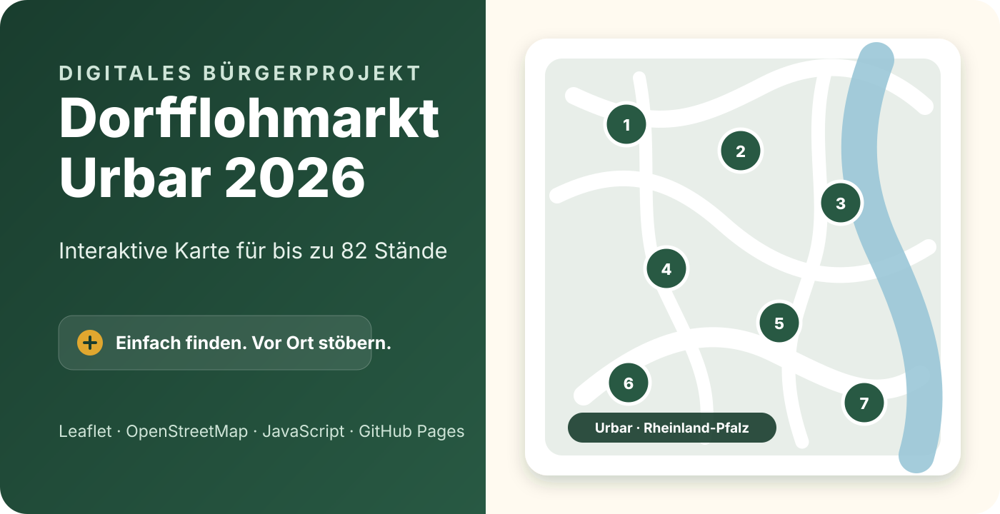
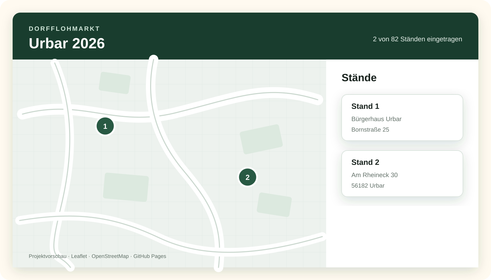

# Dorfflohmarkt Urbar 2026



Interaktive Karte für die Stände des Dorfflohmarkts in **56182 Urbar**.

Die Anwendung zeigt die teilnehmenden Standorte auf einer Karte und zusätzlich in einer übersichtlichen Liste. Sie ist für Smartphones, Tablets und Desktop-Rechner ausgelegt und wird als statische Website über GitHub Pages veröffentlicht.

> Ein digitales Bürgerprojekt ohne App-Installation und ohne Benutzerkonto: Link öffnen, Stand finden und losstöbern.

## Live-Version

[**Interaktive Karte öffnen**](https://mpusceddu.github.io/dorfflohmarkt-urbar/)

## Vorschau



## Funktionen

- nummerierte Standorte auf einer interaktiven Karte
- Kartendarstellung mit Leaflet und OpenStreetMap
- zusätzliche Standliste unterhalb der Karte
- Bedienung per Maus, Touch und Tastatur
- optionale Beschreibung des jeweiligen Angebots
- automatische Anzeige der eingetragenen Standanzahl
- Darstellung von bis zu 82 Flohmarktständen
- keine Datenbank und kein komplizierter Build-Prozess erforderlich

## Verwendete Technik

- HTML5
- CSS3
- JavaScript
- [Leaflet](https://leafletjs.com/)
- [OpenStreetMap](https://www.openstreetmap.org/)
- GitHub Pages

## Standdaten pflegen

Die Standorte werden in der Datei [`standdaten.js`](standdaten.js) gepflegt.

Beispiel:

```javascript
{
  nummer: 3,
  adresse: "Beispielstraße 12, 56182 Urbar",
  angebot: "Bücher, Spielzeug und Haushaltswaren",
  lat: 50.000000,
  lng: 7.000000
}
```

### Pflichtfelder

- `nummer`
- `adresse`

### Optionale Felder

- `angebot`
- `lat`
- `lng`

Ohne Koordinaten erscheint ein Stand weiterhin in der Liste, aber nicht als Marker auf der Karte.

## Lokal testen

Das Projekt kann ohne Installation eines Frameworks gestartet werden.

```bash
python3 -m http.server 8000
```

Danach im Browser öffnen:

```text
http://localhost:8000
```

## Datenschutz und Veröffentlichung

Die veröffentlichten Standorte können private Wohnadressen enthalten. Deshalb sollten sie nur mit klarer Einwilligung der teilnehmenden Personen veröffentlicht werden.

Wichtig: Auch gelöschte Daten können in der Versionsgeschichte eines öffentlichen GitHub-Repositories erhalten bleiben. Vor dem Eintragen echter Privatadressen sollte daher festgelegt werden,

- welche Daten öffentlich erscheinen,
- wie lange sie benötigt werden,
- wie die Einwilligung dokumentiert wird und
- wie mit der Repository-Historie nach der Veranstaltung umgegangen wird.

## Projektstatus

In Vorbereitung für den Dorfflohmarkt Urbar 2026. Die Standorte werden ergänzt, sobald die endgültigen Anmeldedaten vorliegen.

## Projekt und Kontakt

Konzipiert als praktisches digitales Bürgerprojekt für Urbar.

- [Marco Pusceddu auf GitHub](https://github.com/mpusceddu)
- [Persönliche Website](https://marcopusceddu.de/)

## Kartendaten

Kartendaten © [OpenStreetMap-Mitwirkende](https://www.openstreetmap.org/copyright)
